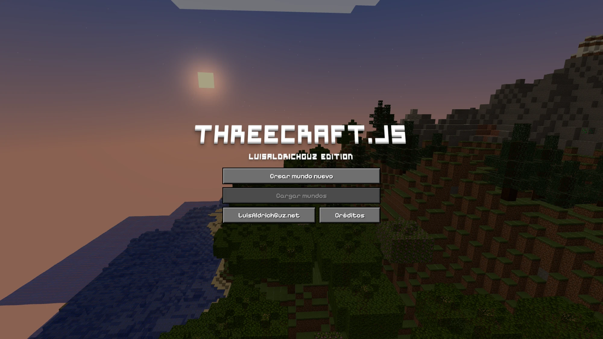
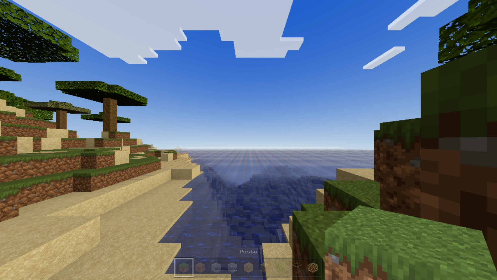
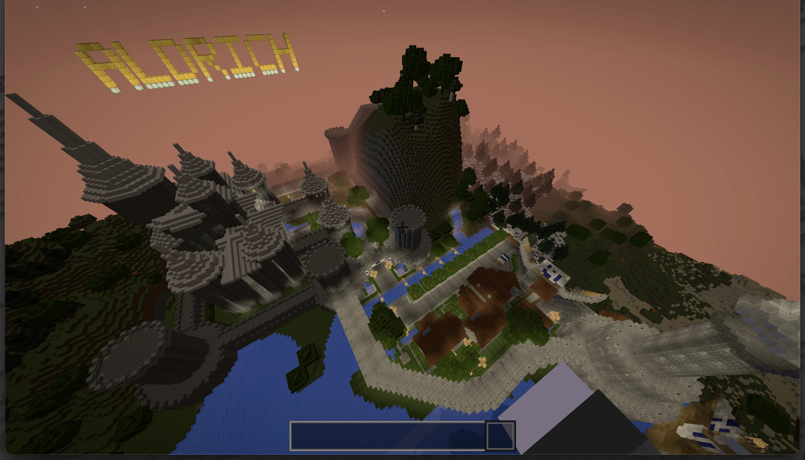
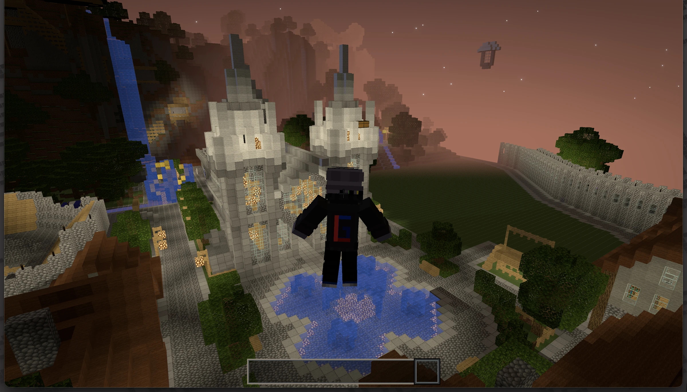
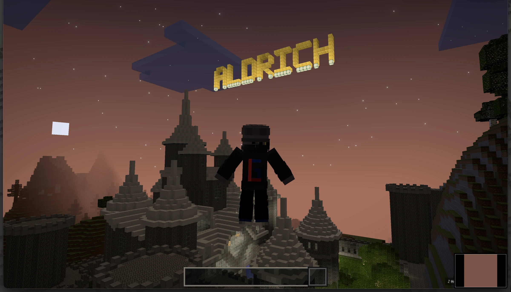
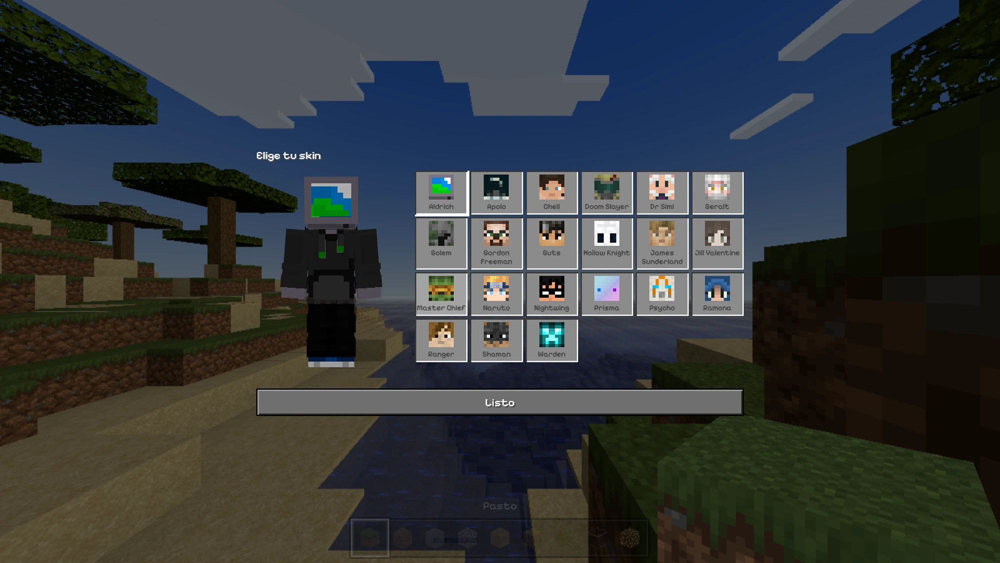

# ThreeCraft.js

> **NOT AN OFFICIAL MINECRAFT PRODUCT. NOT APPROVED BY OR ASSOCIATED WITH MOJANG OR
> MICROSOFT.** Minecraft es una marca registrada de Mojang AB / Microsoft Corporation.
> Esto es un juego de bloques independiente, inspirado en Minecraft, hecho con Three.js.

Un juego de bloques en el navegador con React + Three.js, **sin motor y sin librerias de
voxels**. Mundo infinito procedural con biomas, cuevas y menas; luz por vertice, sombras,
rayos de sol, ciclo de dia y noche, nubes y agua con shader; primera y tercera persona,
inventario con 224 bloques y todo guardado en el navegador.

### 🎮 [Jugar aqui](https://threecraft.luisaldrichguz.net)



---


*Terreno estilo 1.18: continentalidad, erosion y picos con splines, diez biomas, cuevas
espagueti y de queso, menas por profundidad.*


*El mundo de serie: toda la ciudad de Lividus, unos 1.9 millones de bloques editados.*




*Tercera persona, con el muneco animado y sus poses.*



## Correr

```bash
npm install
npm run dev
npm run build        # tsc + vite
```

Controles: WASD · espacio salta (doble: volar) · Shift corre · Ctrl/C agacha · clic izq.
rompe (manten) · clic der. pone · clic medio copia · rueda/1-9 hotbar · E inventario ·
V/F5 camara · F3 info · Esc pausa.

Como esta hecho y por donde tocar: **[CLAUDE.md](CLAUDE.md)** (indice) y
**[docs/arquitectura.md](docs/arquitectura.md)** (el detalle).

## Licencias

El **codigo fuente** esta bajo la [PolyForm Noncommercial 1.0.0](LICENSE). En corto, si lo
clonas o lo usas de base, estas tres son obligatorias:

1. **Enlazar este repositorio** como el original del que partiste.
2. **Acreditar a [LuisAldrichGuz](https://github.com/LuisAldrichGuz)** como autor, de forma
   visible (README, creditos del juego o pantalla de inicio).
3. **No cobrar por el.** Nada de venderlo, ponerle anuncios, donaciones ligadas al proyecto
   ni meterlo detras de un muro de pago.

Fuera de eso, uselo quien quiera: modificarlo, aprender de el y compartirlo esta bien.

Los **assets que vienen dentro no son mios** y cada uno trae la suya:

| Carpeta | Que es | Licencia |
|---|---|---|
| `public/textures/` | [Faithful 32x](https://faithfulpack.net), rama Java 1.21.11 | [Faithful License](https://faithfulpack.net/license) — copia en `LICENSE-FAITHFUL.txt`, detalle en `CREDITS.md` |
| `public/worlds/` | «Castle Lividus of Aeritus» de KyleCRat | [CC BY-NC-SA 3.0](https://creativecommons.org/licenses/by-nc-sa/3.0/) — ver `LICENSE-WORLDS.md` |
| `public/music/` | cinco pistas de OpenGameArt | CC0 1.0 — ver `CREDITS.md` |
| `public/sounds/` | efectos de Kenney | CC0 1.0 — ver `LICENSE.md` |

Las skins de personajes de otros (videojuegos, comics) **no se distribuyen aqui**: solo va
la del autor. Si tienes las tuyas, ponlas en `public/skins/` y listalas en
`public/skins/extra.json`.
